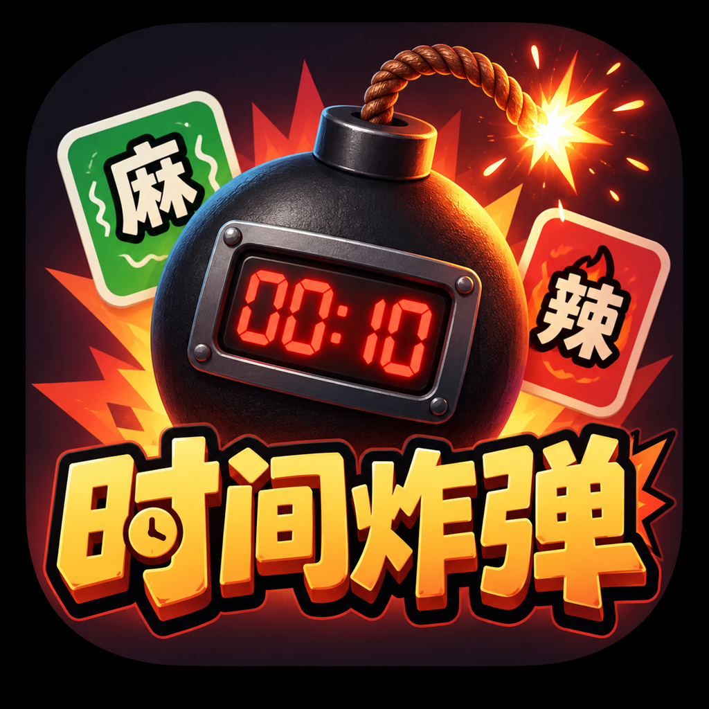

# 役次元 · 时间炸弹

**把倒计时交给下一位玩家。**

这是役次元的多人轮流传递游戏。玩家连接兼容的蓝牙 EMS 设备后，轮流持有一颗不断加料的“时间炸弹”；倒计时结束时，当前玩家会触发自己绑定的设备。

游戏支持多台设备、双通道绑定和一代/二代设备协议。我们把它开源，方便玩家、开发者和同行继续改造，做出更多好玩的版本。

<p align="center">
  
</p>

## 玩法

### 时间炸弹 · 多人轮流挑战

先连接 EMS 设备，为每位玩家分配设备通道并完成安全测试。游戏开始后，手机会显示当前玩家和剩余时间；玩家可以为炸弹增加克数、加入麻料或辣料，然后把手机和炸弹交给下一位玩家。

时间归零时，当前玩家的绑定通道会播放一段快速衰减的冲击波。触发结束后可以重新开始，也可以返回设置页重新配置玩家和设备。

## 游戏规则

- 每局至少需要 2 名玩家，最多支持 8 名玩家。
- 游戏总时长由玩家设置，单位为秒；倒计时只在玩家持有炸弹并处于运行状态时消耗。
- 炸弹初始为 `10` 克，每轮至少增加 `1` 克，整局最多为 `180` 克。
- 每次加入麻料或辣料，输出频率增加 `5`；基础频率为 `50`，最高为 `100`。
- 麻料和辣料可以混合添加，最终结果会显示本局累计克数和口味。
- 时间归零后，系统只触发当前玩家已确认的设备通道；触发完成后会自动停止输出。
- 手动退出、重新开始或离开游戏页面时，系统会尽力停止所有设备输出。
- 设备连接失败、通道测试失败或缺少玩家绑定时，游戏不会允许开始。

## 好玩的点子，值得有更多版本

时间炸弹从一个“把手机传下去”的想法，变成了可以连接真实设备、支持多人配置和现场测试的完整玩法。

喜欢这个玩法，欢迎直接拿去研究和改造；有自己的想法，也欢迎在它的基础上继续做出新的版本。

## 开源与许可

本项目采用 [MIT 许可证](LICENSE)。简单来说，你可以：

- 免费使用、复制和分享本项目。
- 修改代码并制作自己的版本。
- 将本项目用于商业产品、收费项目或线下活动。
- 在保留原许可证和版权声明的前提下继续分发。

## 开始体验

这是一个 Flutter 项目，本地运行需要 Flutter SDK：

```bash
flutter pub get
flutter run
```

连接设备后即可从设置页开始配置玩家、通道和游戏时长。
